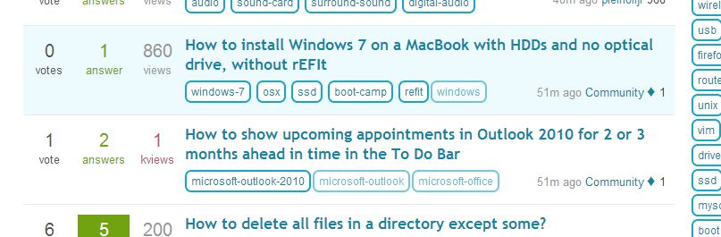

foil
====

`foil` is an experiment to add an implicit tagging hierarchy to Stack Exchange sites.

Details
-------

A question that is tagged with `windows-8` *should* also be treated as if it was tagged with `windows`. As **Windows 8** is a specialization of **Windows**. The response to this issue has always been that "windows" is a substring of "windows-8". Thus, the implicit hierarchy is already in place.

However, on Super User we also have tag structures like `mouse` or `keyboard` which could also be tagged `computer-peripherals` additionally. Also, all questions tagged `rhel`, `ubuntu` or `debian` could also be tagged with `linux`.

Of course, `foil` is just a client-side approach and can't be a proper solution. A question that is tagged with `windows-7` will also receive a "foil tag" for `windows`. However, the question obviously isn't really tagged with `windows`. If you would perform a search on the site for all questions tagged with `windows`, the question would not be found.